# Healthcare Analytics Chatbot
### Sandip Panesar MD MSc MIDS

## Overview
An agentic healthcare analytics chatbot built on LangGraph, designed to let analysts query a claims database through natural language. The original codebase was a single-file synchronous chat loop with manual tool dispatch and no state management. This solution replaces it entirely with an async, multi-node graph architecture — adding structured routing, persistent memory, cohort management, statistical analysis, streaming, a Chainlit web frontend, and a comprehensive test suite. The system goes beyond simple Q&A — users can build, persist, and statistically compare patient cohorts across sessions, and the modular LangGraph framework makes it straightforward to add new tools and capabilities.

Key capabilities:
- **Stateful graph architecture** with persistent memory across conversation turns
- **Chainlit frontend** with streaming responses, tool-call visibility, and thread history
- **Guardrails** that keep the conversation scoped to healthcare analytics
- **Query expansion** Helped to optimize DB searches by expanding on vague user queries
- **Cohort builder** that translates natural language into patient selections, stored as named temporary tables for downstream analysis
- **Cohort comparator** that profiles two populations across demographics, diagnoses, medications, and mortality — with statistical significance testing
- **Versatile Capabilities** Supports a range of query types including ability to analyze groups of patients, individual patients, temporal analyses among many others

## Architecture

LangGraph is a stateful orchestration layer for building multi-step, agentic workflows. It permits a high level of control, while also allowing for flexible, model-driven decision making within a structured execution graph. It allows routing, loops, tool use, and state updates, yet still gives an LLM a degree of autonomy in deciding how to navigate and reason within those boundaries. This makes it well-suited for complex, reliable AI systems that need both predictability and adaptability.

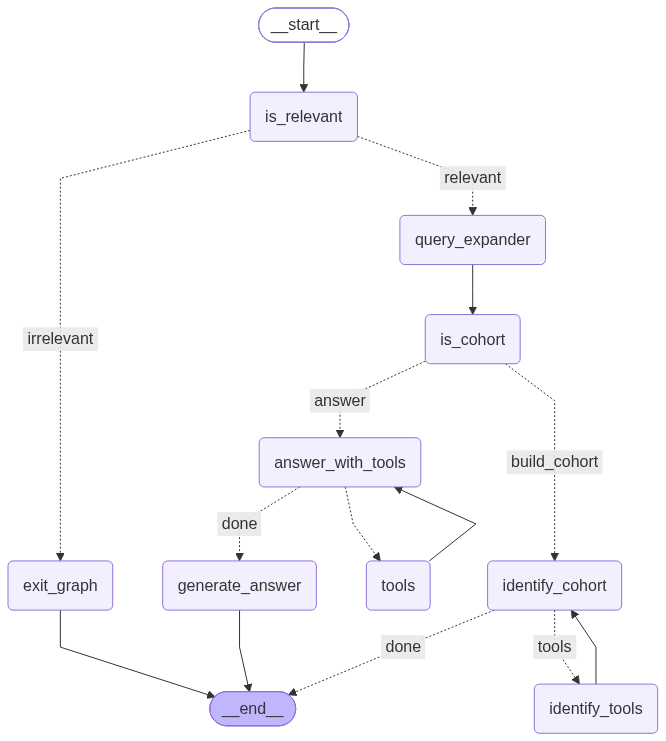

### Graph Nodes

The workflow is composed of specialized nodes, each responsible for a single concern:

| Node | Role |
|---|---|
| **is_relevant** | Classifies whether the user's question falls within the healthcare analytics domain. Off-topic queries are routed to a graceful exit. |
| **is_cohort** | Determines whether the user intends to build or modify a patient cohort versus running a general analytical query. |
| **query_expander** | A filtering node that is designed to expand on user queries if too vague e.g. "beta blockers". |
| **exit_graph** | Generates a polite refusal for out-of-scope questions, preserving conversational tone. |
| **answer_with_tools** | The primary analytical node. Invokes database tools to answer healthcare questions, with cohort context injected when available. |
| **identify_cohort** | Drives cohort construction — explores the schema, writes selection SQL, and persists the result as a named temporary table for downstream use. |
| **tools / identify_tools** | Shared tool execution layer. Separate node aliases route results back to their respective callers, enabling independent tool loops for general queries and cohort building. |
| **generate_answer** | Extracts the final natural-language answer from the message history and surfaces it to the user. |

Routing between nodes is handled by conditional edges that inspect state flags and message content, giving the graph a clean separation between classification, execution, and response generation.


## Design Decisions

### Multi-Agent Orchestration
Rather than a monolithic prompt-and-respond loop, the system is structured as a multi-agent graph. Each node acts as a specialized sub-agent with its own system prompt, tool access, and responsibilities. The router nodes use structured Pydantic output for classification, while the execution nodes operate autonomously within their tool loops — querying the schema, writing SQL, and iterating until they arrive at an answer. This separation means each agent can be developed, tested, and prompted independently.

### Stateful Memory
The graph maintains state across turns via LangGraph's `MemorySaver` checkpointer. Beyond message history, the state tracks named cohorts — temporary tables created during cohort building that persist for the duration of a session. When cohorts exist, their names and descriptions are injected into downstream prompts, allowing the LLM to reference and query against them naturally. This gives the system a form of working memory that grows as the user builds up their analysis.

### Streaming & Observability
Both the CLI and Chainlit interfaces stream responses token-by-token via LangGraph's `astream_events` API. In the Chainlit frontend, tool invocations are rendered as collapsible steps, giving the user real-time visibility into the agent's reasoning — which tables it inspects, what SQL it writes, and what results it receives. Thread persistence via the Chainlit data layer allows users to create, revisit, and resume previous sessions from the sidebar.

### Reliability
All LLM-calling nodes are wrapped in an exponential backoff retry decorator that handles transient OpenAI errors (rate limits, timeouts, connection failures). Tool execution uses LangGraph's built-in error handling to surface failures as messages rather than crashing the graph.

### Extensibility
Tools are organized in a single `HealthcareTools` class with clearly separated groups. Adding a new capability requires defining a function with a docstring and appending it to the appropriate tool list. The LLM discovers tool schemas at runtime, so no prompt changes are needed. The underlying database module also supports exporting query results to CSV and JSON for use in external tools.

### Async-First
The entire stack is async — from LangGraph execution to tool calls to the Chainlit server. This means the application can serve multiple concurrent users without blocking, making it ready to deploy behind a load balancer as a production API. All database access is serialized via a threading lock on the DuckDB connection, ensuring safe concurrent tool execution when LangGraph runs parallel tool calls.

### Testing
The test suite covers three layers: router classification logic, database tool operations (including cohort creation, temp table persistence, and statistical comparisons), and graph routing and state schema integrity.

### Cohort Analysis
The system's standout domain feature is its cohort builder and comparator. Users define patient populations through natural language, and the LLM translates this into selection SQL over the claims data — handling pipe-delimited ICD code formats and multi-table joins. Cohorts are stored as named temp tables that can be narrowed, expanded, or compared. The comparator provides a statistical profile across demographics, diagnoses, medications, and mortality, including t-tests, chi-squared tests, and relative risk calculations.

## How to Run

### Prerequisites

- Python 3.13+
- [uv](https://github.com/astral-sh/uv) package manager
- OpenAI API key
- Docker (for Chainlit thread persistence only)
- Node.js >= 20 (for Prisma migration only)

### 1. Install dependencies

```bash
uv sync
```

### 2. Configure environment variables

Create a `.env` file in the project root:

```bash
cp env.template .env
```

Add your OpenAI API key:

```
OPENAI_API_KEY=sk-...your-actual-key...
CHAT_MODEL=gpt-4o
STREAMING=True
RETRY_ATTEMPTS=3
```

### 3a. Run the Chainlit frontend with thread persistence

Thread persistence requires PostgreSQL via the [Chainlit data layer](https://github.com/Chainlit/chainlit-datalayer). Clone that repo (outside of this one), then:

```bash
cd chainlit-datalayer
docker compose up -d
npx prisma@6 migrate deploy
```

In this repo run:

```
chainlit create-secret
```

And update `CHAINLIT_AUTH_SECRET` in `.env`

Then launch:

```bash
chainlit run app.py
```

This should automatically launch the app in your browser.

**NB: Click on the readme in upper right to see instructions and tips for using the app**

### 3b. Run the CLI (no Docker required)

```bash
uv run python main.py
```

Provides the same streaming chatbot experience in the terminal — no PostgreSQL or Docker needed.

### 4.1 Example 1

#### Identify Cohort, Visualize Tool Calls and Queries

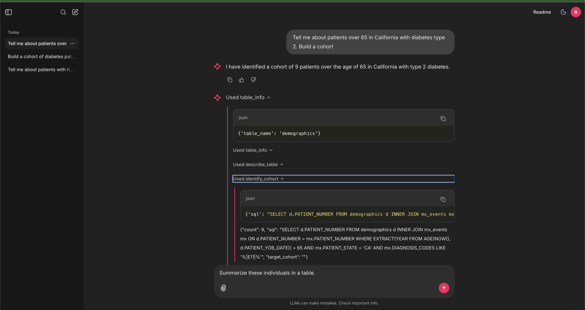

#### Create a Summary Table

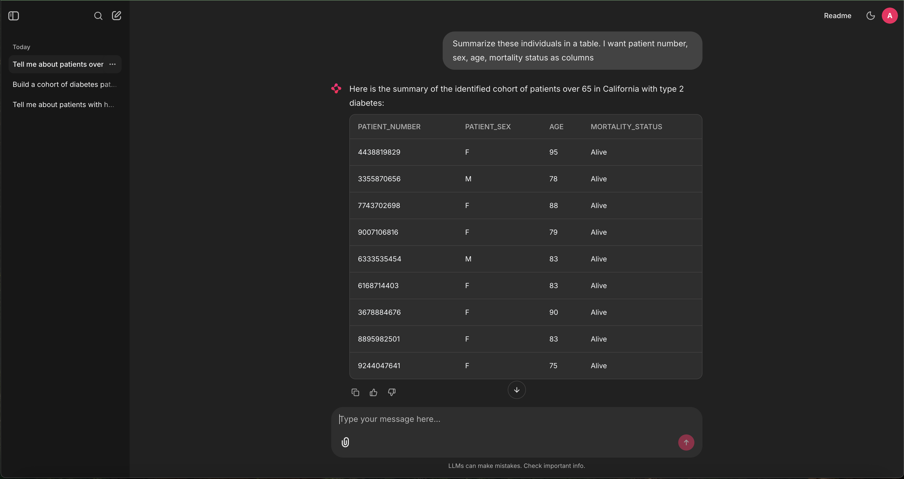

#### Drill Down on Single Patient

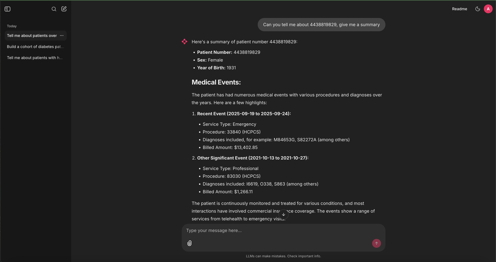

#### Build a Comparator Cohort

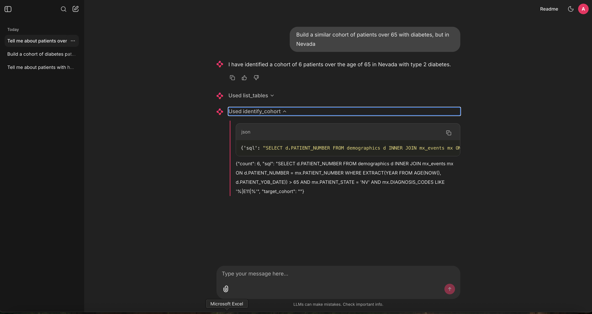

#### Compare Cohorts

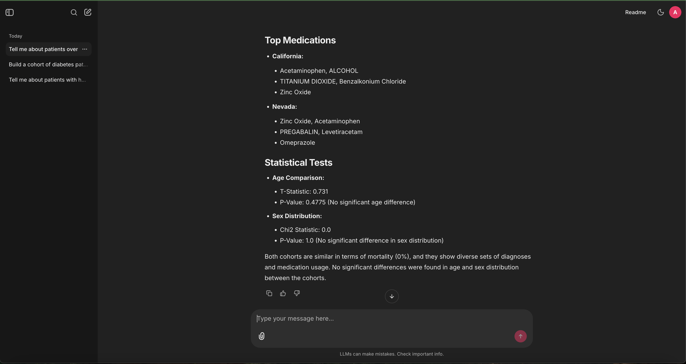

#### Temporal Analysis

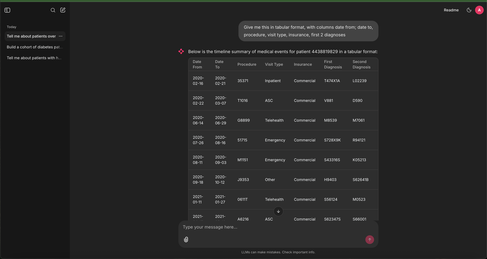

### 4.2 Example 2

#### Identify and build a cohort of an at risk group (COPD + beta blockers)

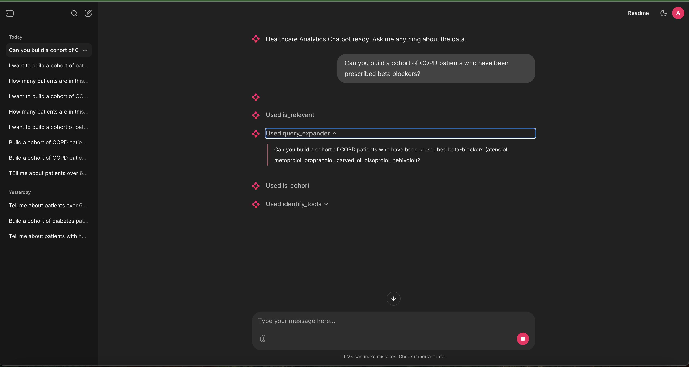

NB: query expander used here to expand on the drugs used.

#### Identify another cohort of same group without drug 

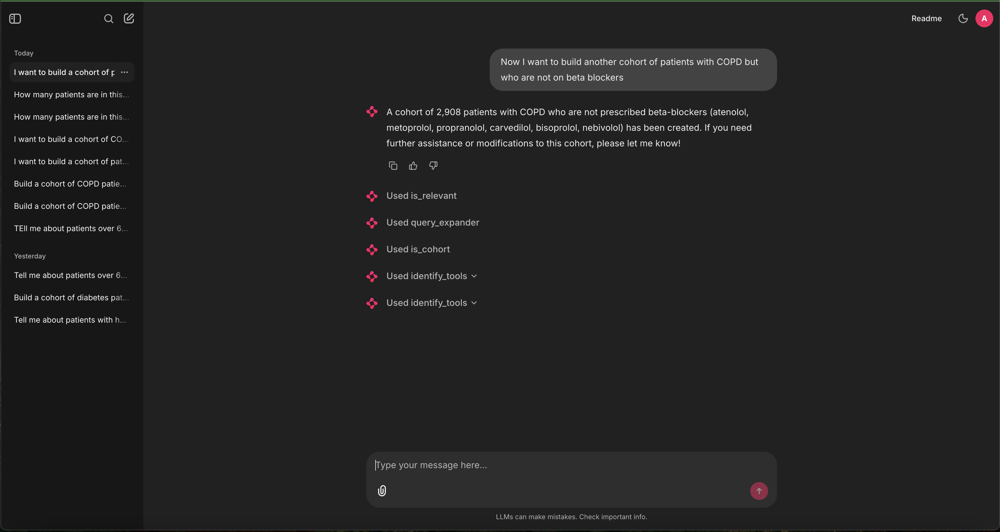

#### Conduct an analysis using the cohort analysis tool 

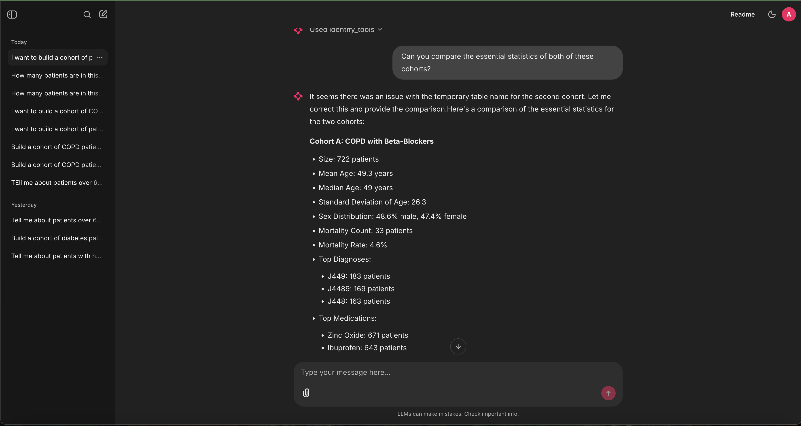

#### Ask LLM to find differences between groups that could be useful 

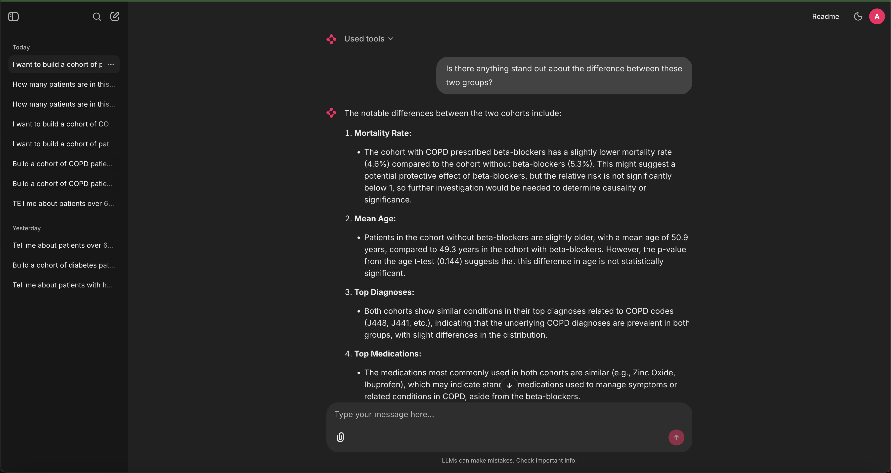

### 5. Proposed Changes

The priority would be spending more time with the data and with end users — understanding real analyst workflows, pain points, and the kinds of questions that matter most in practice. That context would shape which of the following to build first:

- **Improved Orchestration** - Decompose queries into a plan before execution by agent
- **FastAPI Service** - Serve the main chatbot as an application that allows multiple frontend instances to connect to it, thus allowing for multiple users
- **Query decomposition** - Right now, its handled with prompting, however I would like to explore a dedicated query decomposition node that decomposes queries into more specific language to aid building the SQL queries. This would be useful if vector stores are included. 
- **Data visualization** — Inline charts and plots via a tool the LLM can invoke directly
- **Persistent cohorts** — Store cohort SQL in PostgreSQL so they survive session switches
- **New functionality** - Drug interaction detection, report generation

